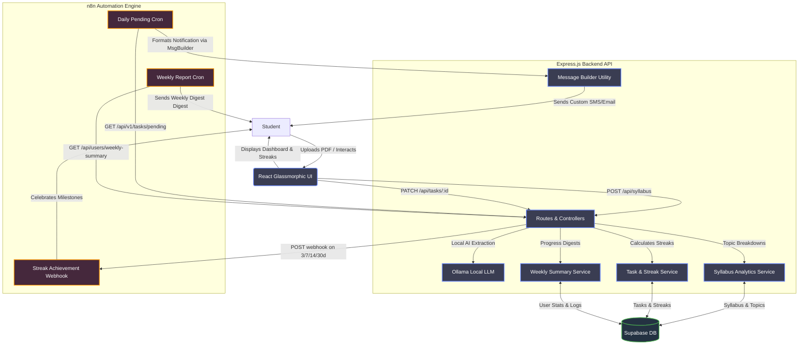

# AI Study Planner 📊

An intelligent Web SaaS application designed to help students convert complex syllabi into structured, actionable daily study plans.

## 🎯 Product Vision

Students often struggle to organize extensive syllabi into manageable daily routines. The **AI Study Planner** bridges this gap by automatically extracting topics from uploaded documents and distributing them across a customized timeline, providing a modern dashboard for tracking progress and ensuring consistency through automated reminders.

---

## 🚀 Recent Upgrades & Advanced Integrations

- **🔥 Gamified Study Streak Tracking:** Implemented a robust consistency engine. Marking tasks as completed dynamically calculates `current_streak`, `longest_streak`, and `total_completed_tasks` inside a secure `user_stats` table in Supabase. Includes rolling 28-hour sequence verification to gracefully handle daily study loops and prevent unfair lapses.
- **⚡ Milestone-Based Webhooks:** Connected the streak tracking engine to the **n8n Automation Server**. Reaching major milestones (3, 7, 14, or 30 days) automatically triggers an asynchronous POST callback to n8n (`http://localhost:5678/webhook/streak-achievement`) to celebrate user achievements.
- **📊 Syllabus Analytics Engine:** Exposed a comprehensive analytics endpoint (`GET /api/syllabus/analytics/:userId`) yielding deterministic structural breakdowns of uploaded syllabi. Computes total topics, completed items, subject distribution graphs, estimated study timeframe (in weeks), and recommendations for daily study load.
- **🤖 n8n Automated Alerts Router:** Developed `GET /api/v1/tasks/pending` querying users with unfinished tasks today to feed daily morning SMS/Email workflows. Includes a centralized `buildMessage` utility for constructing personal, human-like reminder messages.
- **📈 Weekly Progress Summaries:** Introduced `GET /api/users/weekly-summary` (all users) and `GET /api/users/weekly-summary/:userId` (specific user). It tracks weekly task logs (last 7 days), calculates completion percentages, pinpoints strongest/weakest subjects, and forecasts upcoming study load ("Light", "Moderate", "Heavy" based on remaining workload).
- **🎨 Glassmorphic Premium Dark UI/UX:** Complete design system overhaul with premium dark aesthetics, glassmorphism card frames, smooth transitions, and vibrant accents that make study planning a visual delight.
- **🛡️ Global Express Rate Limiter:** Configured backend rate limits to protect endpoints against API abuse and secure system scalability.

---

## ✨ Core Features

### 1. 🔐 Secure Authentication
- Full authentication system powered by **Supabase Auth**.
- Secure registration, email-based credentials, and state persistence.
- Auto-syncing of user profiles upon registration.

### 2. 📂 Intelligent Syllabus Processing
- **Multiple Input Methods:** Upload documents (PDF, DOCX, TXT) or paste raw text.
- **Ollama Local AI Integration:** Extraction of subjects and topics using local models (e.g., Llama 3) for 100% data privacy.
- **File Parsing:** Parses up to 10MB files seamlessly via `multer` and `pdf-parse`.

### 3. 🗓️ Smart Study Plan Generation
- Formulates customized timelines based on **Exam Dates** or available study slots.
- Distributes topics across available days evenly to ensure balanced preparation.
- Saves generated study structures automatically to database models.

### 4. ✅ Interactive Task Tracker & Streaks
- Daily study checklists mapping out today's target topics.
- Dynamic task check-off updating progress rings instantly.
- Gamified streak tracking calculating daily progress streaks with lapse recovery.

### 5. 📈 Dashboard Analytics & Summary APIs
- Real-time progress trackers showing percentage completed.
- Summaries of total topics, completed cards, and upcoming goals.
- **Syllabus Analytics API:** Extracts statistics such as hardest/largest subjects and weekly workload suggestions.
- **Weekly Progress Digests:** Calculates weekly completion rates, highlighting strongest & weakest subjects.

### 6. 📧 Automation & External Webhooks (n8n Ready)
- **Streak Milestones:** Fires POST webhooks to n8n upon hitting 3/7/14/30 days streaks.
- **Pending Tasks Alerts:** Exposes endpoint for n8n cron workers to check remaining tasks today.
- **Automated Messaging Builder:** Utility compiling formatted plain text notifications.
- **Email Reminders:** Dispatching system built with standard scheduler triggers.

---

## 🛠️ Tech Stack

### Frontend
- **Framework:** React 19 (Vite)
- **Styling:** Tailwind CSS 4.2 & CSS Variables
- **Design System:** Custom Dark Glassmorphism, tailored HSL color palettes
- **Animations:** Framer Motion & GSAP
- **Icons:** Lucide React
- **Routing:** React Router Dom
- **State Management:** React Hooks & Context API
- **Date Handling:** Day.js

### Backend & Automation
- **Runtime:** Node.js
- **Framework:** Express 5.2
- **Database & Auth:** Supabase (PostgreSQL client)
- **AI Processing:** Ollama (Local Llama 3 Integration)
- **HTTP Client:** Axios (for outbound webhooks)
- **Automation Pipeline:** n8n Workflow Integration & Node-cron scheduler
- **Security:** Helmet, CORS, and Express Rate Limiter
- **Logging:** Morgan Logger

---

## 📂 Project Structure

```text
D:\SAAS\
├── backend/                  # Express.js Server
│   ├── config/               # Database client and Supabase configuration
│   ├── controllers/          # Request routers (syllabus, task, user, chat)
│   ├── middleware/           # Auth validation, rate limiters, validation schemas
│   ├── routes/               # API endpoints (auth, tasks, syllabus, users)
│   ├── services/             # Core business logic
│   │   ├── aiService.js      # Local Ollama LLM integration
│   │   ├── taskService.js    # Tasks handling, streaks, and milestone webhooks
│   │   ├── weeklySummary.js  # Weekly progress summaries and load forecasts
│   │   ├── syllabusService.js# Syllabus Analytics and distribution logic
│   │   └── emailService.js   # Email composition and dispatch
│   └── utils/                # Helper tools (Message builder, parsers)
├── frontend/                 # React Application (Vite)
│   ├── src/
│   │   ├── components/       # Reusable Glassmorphic UI elements
│   │   ├── context/          # State and authentication wrappers
│   │   ├── pages/            # View pages (Dashboard, Syllabus Upload, Chat)
│   │   ├── hooks/            # Custom hooks (useTasks, etc.)
│   │   └── styles/           # Styling assets and system colors
└── database/                 # SQL schemas and configuration
```

---

## 📐 Architecture & Integration Flow Diagram



---

## 🔄 Key User & Automation Flows

1.  **Onboarding & Upload:** User signs up -> Accesses Dashboard -> Uploads Syllabus PDF (local extraction via Ollama AI).
2.  **Syllabus Analysis:** Syllabus Analytics calculates workload distribution, challenges, and timeline weeks.
3.  **Daily Study Loop:** User views Glassmorphic Task List -> Marks tasks done -> Streak engine updates.
4.  **Streak Milestones:** Streak hits 3/7/14/30 days -> Backend fires webhook to n8n to send celebration/alerts.
5.  **Daily Cron Automation:** n8n queries `/api/v1/tasks/pending` -> Identifies user -> Formats message via `buildMessage` -> Dispatches daily reminder.
6.  **Weekly Digests:** n8n queries `/api/users/weekly-summary` -> Emails personalized weekly summary report to user.

---

## 🚀 Getting Started

### Prerequisites
- Node.js (v18+)
- Supabase Account and Database
- Ollama running locally (for private AI extraction)
- n8n instance (optional, for automation features)

### Installation & Setup

1.  **Clone the repository**
2.  **Backend Setup**
    ```bash
    cd backend
    npm install
    # Create .env with database credentials, port, and Ollama settings:
    # SUPABASE_URL=YOUR_URL
    # SUPABASE_KEY=YOUR_KEY
    # OLLAMA_URL=http://localhost:11434 (default)
    npm start
    ```
3.  **Frontend Setup**
    ```bash
    cd frontend
    npm install
    npm run dev
    ```

---

## 🎨 Design Principles
- **Modern SaaS Dark Theme:** Highly-polished, distraction-free premium visual layout.
- **Color Palette:**
    - Action Blue: `#6C8BFF`
    - Success Green: `#4CAF50`
    - Background: Deep sleek greys & blacks with blurred backdrop glass layers.
- **Typography:** Outfit / Inter (Google Fonts)

---

## 📊 Success Metrics
- **Performance:** Local extraction and plan generation complete in < 5 seconds.
- **Consistency:** 65%+ daily completion rates via streak notifications.
- **Accuracy:** Zero external server dependencies for AI parsing.

---

## 🔐 Privacy & Safety
All syllabus materials are processed locally via Ollama. Data never leaves your machine. User analytics and streaks are securely compartmentalized via Supabase Row-Level Security (RLS).
