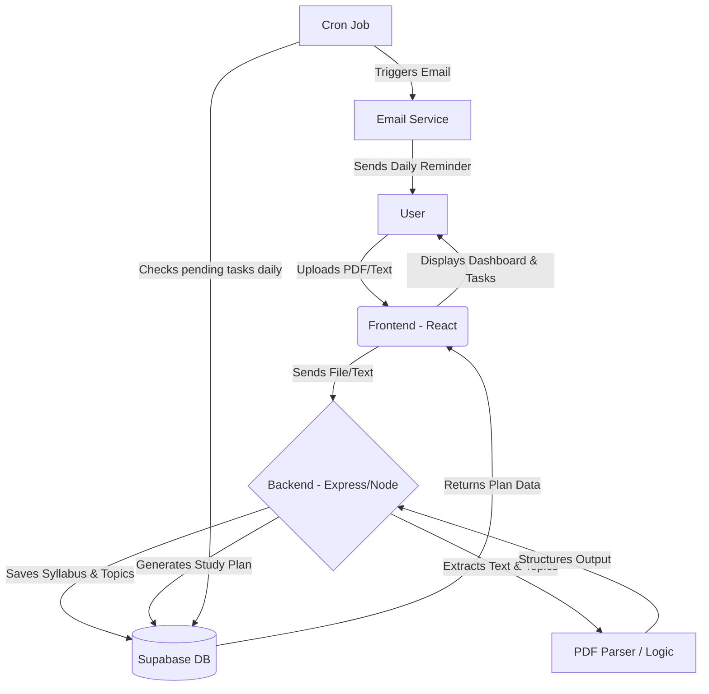

# AI Study Planner 📊

An intelligent Web SaaS application designed to help students convert complex syllabi into structured, actionable daily study plans.

## 🎯 Product Vision

Students often struggle to organize extensive syllabi into manageable daily routines. The **AI Study Planner** bridges this gap by automatically extracting topics from uploaded documents and distributing them across a customized timeline, providing a modern dashboard for tracking progress and ensuring consistency through automated reminders.

---

## ✨ Core Features

### 1. 🔐 Secure Authentication
- Full authentication system powered by **Supabase**.
- Secure login and registration flows.
- User profile management and data persistence.

### 2. 📂 Intelligent Syllabus Processing
- **Multiple Input Methods:** Upload files (PDF, DOCX, TXT) or paste raw text.
- **Automated Extraction:** Backend processing identifies core subjects and topics from the syllabus content.
- **File Handling:** Supports uploads up to 10MB via `multer` and `pdf-parse`.

### 3. 🗓️ Smart Study Plan Generation
- Custom schedules based on **Exam Dates** or **Available Days**.
- Intelligent topic distribution across the selected timeframe.
- Automatic saving of generated plans to the database.

### 4. ✅ Interactive Task Tracker
- Daily study checklists to keep users focused.
- Mark topics as completed to track real-time progress.
- Updates dashboard analytics instantly upon task completion.

### 5. 📈 Dashboard Analytics
- Visual progress tracking (Percentage completed).
- Summary of total topics, completed tasks, and upcoming goals.
- Modern productivity-focused interface.

### 6. 📧 Automated Email Reminders
- Daily reminders sent at 8:00 AM.
- Integrated workflow for task summaries.
- Powered by `node-cron` on the backend.

---

## 🛠️ Tech Stack

### Frontend
- **Framework:** React 19 (Vite)
- **Styling:** Tailwind CSS 4.2
- **Animations:** Framer Motion & GSAP
- **Icons:** Lucide React
- **Routing:** React Router Dom
- **State Management:** React Hooks & Context API
- **Date Handling:** Day.js

### Backend
- **Runtime:** Node.js
- **Framework:** Express 5.2
- **Database & Auth:** Supabase
- **File Processing:** Multer & pdf-parse
- **Automation:** Node-cron
- **Security:** Helmet & CORS
- **Logging:** Morgan

---

## 📂 Project Structure

```text
D:\SAAS\
├── backend/            # Express.js Server
│   ├── config/         # Database configurations
│   ├── controllers/    # API request handlers
│   ├── middleware/     # Auth and error handling
│   ├── routes/         # API endpoint definitions
│   ├── services/       # Core business logic (AI, Plan, Task)
│   └── utils/          # Helper functions (Parser, Logger)
├── frontend/           # React Application
│   ├── src/
│   │   ├── components/ # Reusable UI components
│   │   ├── context/    # Auth and State Management
│   │   ├── pages/      # View components (Dashboard, StudyPlan)
│   │   ├── services/   # API client services
│   │   └── styles/     # Global styling (Tailwind)
└── database/           # Schema documentation
```

---

## 📐 Architecture & Flow Diagram



---

## 🔄 Key User Flows

1.  **Onboarding:** Sign up -> Dashboard access.
2.  **Creation:** Upload Syllabus -> Set Exam Date -> Generate Plan.
3.  **Daily Use:** View Tasks -> Complete Study Session -> Mark Done.
4.  **Automation:** Receive morning email -> Follow direct link to tasks.

---

## 🚀 Getting Started

### Prerequisites
- Node.js (v18+)
- Supabase Project Credentials

### Installation

1.  **Clone the repository**
2.  **Backend Setup**
    ```bash
    cd backend
    npm install
    # Create .env with SUPABASE_URL, SUPABASE_KEY, etc.
    npm start
    ```
3.  **Frontend Setup**
    ```bash
    cd frontend
    npm install
    npm run dev
    ```

---

## 🎨 Design Principles
- **Modern SaaS Aesthetics:** Clean, minimalist, and productivity-focused.
- **Color Palette:**
    - Primary: `#6C8BFF` (Action Blue)
    - Accent: `#4CAF50` (Success Green)
    - Background: `#F5F7FB` (Soft Grey)
- **Typography:** Inter (Primary System Font)

---

## 📊 Success Metrics
- **Performance:** Study plan generation in < 5s.
- **Engagement:** Target 60% task completion rate among active users.
- **Scale:** Optimized for 50+ concurrent users in MVP.

---

## 🚫 Out of Scope (MVP)
- Mobile App (Native)
- AI Tutor Integration
- Social Study Groups / Collaboration
- Pomodoro Timer

---

## 🔐 Privacy & Safety
All user data is stored securely via Supabase with encrypted authentication. Syllabus data is handled privately and is only accessible by the authenticated owner.
