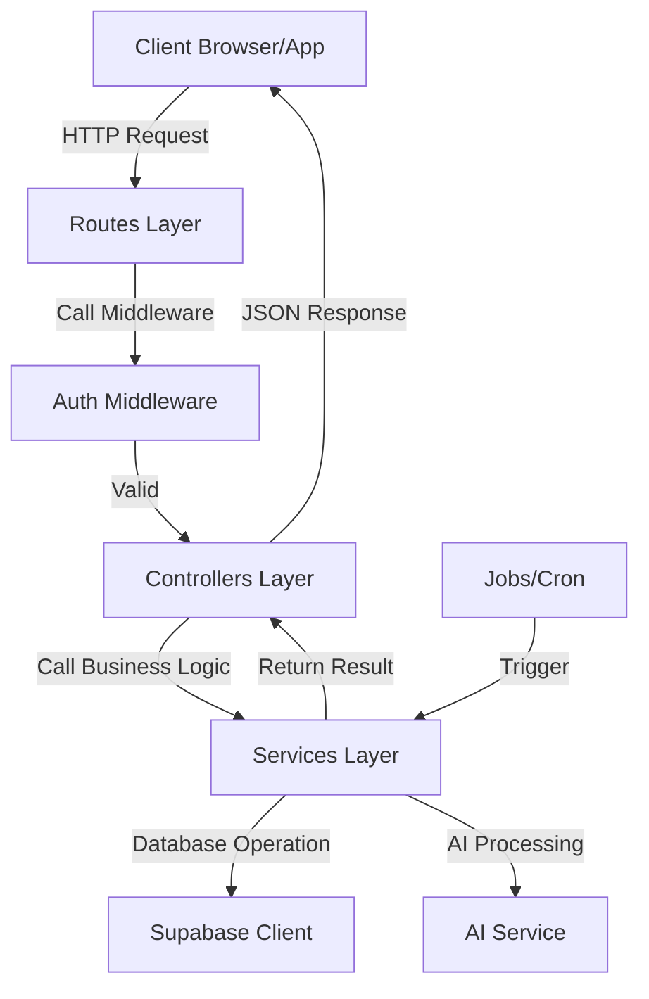

# Backend API Architecture - SAAS Platform

## Overview
This backend is designed as a modular, scalable, and secure API server for a SAAS platform. It follows a clean architecture pattern separating concerns between routing, business logic, and data handling.

## Project Structure
```text
D:\SAAS\backend\
├── controllers/            # Request handlers: Extract data from requests and call services
│   ├── authController.js   # Handles user authentication and registration
│   ├── syllabusController.js # Manages syllabus-related operations
│   ├── planController.js     # Handles learning or project plan logic
│   └── taskController.js     # Manages individual tasks and updates
│
├── routes/                 # API routes: Define the endpoints and map them to controllers
│   ├── authRoutes.js       # Endpoints for authentication (login, signup)
│   ├── syllabusRoutes.js   # Endpoints for syllabus management
│   ├── planRoutes.js       # Endpoints for plan generation and retrieval
│   └── taskRoutes.js       # Endpoints for task-related operations
│
├── services/               # Business logic: Core application logic and third-party integrations
│   ├── aiService.js        # Integration with AI providers (e.g., OpenAI, Gemini)
│   ├── schedulerService.js # Logic for scheduling tasks or reminders
│   └── emailService.js     # Logic for sending emails (e.g., via SendGrid or Nodemailer)
│
├── middleware/             # Custom middleware for request processing
│   ├── authMiddleware.js   # Validates JWT tokens or sessions
│   └── errorMiddleware.js  # Global error handling and formatting
│
├── config/                 # Configuration and client initializations
│   └── supabaseClient.js   # Supabase client setup and configuration
│
├── jobs/                   # Background jobs and automation tasks
│   └── reminderJob.js      # Automated jobs for sending task reminders
│
├── utils/                  # Utility functions and shared helpers
│   └── logger.js           # Centralized logging configuration
│
├── app.js                  # Express application setup (middleware, routes)
├── server.js               # Server entry point (starts the HTTP server)
│
├── .env                    # Environment variables (Secrets & Config)
├── package.json            # Project dependencies and scripts
└── README.md               # Project documentation
```

## Workflow Diagram



## Dependencies and Their Use

### Core Dependencies
- **`express`**: The primary web framework for building the RESTful API.
- **`@supabase/supabase-js`**: Client library to interact with Supabase (Database, Auth, Storage).
- **`dotenv`**: Loads environment variables from `.env` file into `process.env`.
- **`cors`**: Middleware to enable Cross-Origin Resource Sharing, allowing frontend apps to talk to this API.
- **`helmet`**: Enhances API security by setting various HTTP headers.
- **`morgan`**: HTTP request logger middleware for development.
- **`axios`**: Promise-based HTTP client for making requests to external APIs (like AI services).
- **`node-cron`**: Used to schedule background tasks (jobs) like daily reminders.
- **`multer`**: Middleware for handling `multipart/form-data`, primarily used for file uploads.

### Development Dependencies
- **`nodemon`**: Restarts the server automatically when file changes are detected.

## Getting Started

1. **Install Dependencies**:
   ```bash
   npm install
   ```

2. **Configure Environment Variables**:
   Create a `.env` file based on your requirements:
   ```env
   PORT=5000
   SUPABASE_URL=your_supabase_url
   SUPABASE_KEY=your_supabase_anon_key
   AI_API_KEY=your_ai_api_key
   ```

3. **Run in Development**:
   ```bash
   npm run dev
   ```

4. **Run in Production**:
   ```bash
   npm start
   ```
